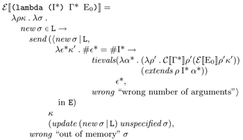

# From denotational semantics to a Scheme interpreter written in Haskell


The R5RS Scheme specification is a 50-page beauty, outlining the
syntax and semantics of Scheme in easy to understand prose, and
concludes with a denotational semantics.  The semantics looks a lot
like Haskell because in a sense it _is_ Haskell!  We can turn the
above image into a Haskell code fragment:

```haskell
-- Evaluate a lambda expression with an environment, continuation and
-- store.
eval (Lambda is gs e0) p k =
  \s ->
    send
      (Ef
         ( new s
         , \es k' ->
             if length es == length is
               then tievals
                      ((\p' -> evalc gs p' (eval e0 p' k')) . extends p is)
                      es
               else wrong "wrong number of arguments"))
      k
      (update (new s) (Em Unspecified) s)
```

Currently, the standard environment contains the following primitive procedures:
```text
+ * - / modulo < > = >= <= cons car cdr list eqv? boolean? symbol?
procedure? pair? number? set-car! set-cdr! null? apply
call-with-values values call-with-current-continuation call/cc
recursive
```

And the following core special forms:
```text
(if <expr> <expr> <expr>)
(if <expr> <expr>)
(set! <id> <expr>)
(lambda <id>* <expr>*)
(lambda <id> <expr>*)
(lambda (<id>* . <id>) <expr>*)
(<expr> <expr>*)
```

Some derived forms have been implemented:
```text
(cond (<expr> <expr>)*)
(let ((<id> <expr>)*) <expr>*)
```

Ensure Cabal is installed and build this project by running `cabal
run`.  The REPL will boot up.  Type an expression and hit ENTER to
evaluate it.

### Usage Examples
```scheme
Scheme> (let* ((fact (recursive (lambda (fact) (lambda (n) (if (eqv? 0 n) 1 (* n (fact (- n 1))))))))) (fact 6))
720
Memory used: 61 cells
```
Alternatively, read it from a file in the `demo` folder, using GHCi:
```text
-- Factorial
SchemeRepl> repf "demo/factorial.scm"
720
Memory used: 59 cells

-- Primes via streams
SchemeRepl> repf "demo/primes.scm"
(2 3 5 7 11 13 17 19 23 29 31 37 41 43 47 53 59 61 67 71)
Memory used: 6410 cells

-- Mutable state
SchemeRepl> repf "demo/counter.scm"
(1 2 3 4)
Memory used: 15 cells
```
## Scheme AST as a Haskell Datatype
The Scheme program:
```scheme
((lambda (x) (+ x x)) 10)
```
Can be written in the Haskell `Expr` datatype as:
```haskell
prog = App (Lambda ["x"] [] (App (Id "+") [Id "x", Id "x"])) [Const (Number 10)]
```
Which can be evaluated in a standard environment and infinite store by running.

```haskell
evalStd prog
```
The result is a triple `(String, [E], S)`, consisting of a string, a
list of results, and the final store (up to the first empty cell).

## Performance notes
The main drawback to performance is the fact that the store is
implemented with lists, which has O(n) time for operations such as
lookups etc.  We could have used Haskell's arrays or sequences instead,
but at the cost of being finite (and potentially requiring an
implementation of GC).

The goal is _not_ to have a super fast Scheme interpreter but rather
serve as a fun exercise and challenge.
### Performance Statistics
```text
SchemeRepl> :set +s
SchemeRepl> repf "demo/primes.scm" 
(2 3 5 7 11 13 17 19 23 29 31 37 41 43 47 53 59 61 67 71)
Memory used: 6410 cells
(19.13 secs, 7,926,912,888 bytes)
SchemeRepl> repf "demo/counter.scm" 
(1 2 3 4)
Memory used: 15 cells
(0.01 secs, 2,506,680 bytes)
```
